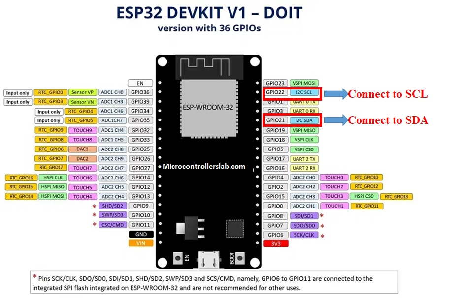

# Projecte Grup 4: Sonòmetre
Descripció general del projecte

 

# 1. Sensor, lectura dades microcontrolador
definicio del que s'ha fet en aquest apartat. Explicar que utilitzarem el microcontrolador ESP32

### 1.1 Característiques del sensor
El sensor que implementarem en el nostre projecte és un sensor de pressió sonora de la marca de components 'PCB Artists' (**I2C Decibel Sound Level Meter Module**). Hem escollit aquest sensor per la seva precisió. Es tracta d'un sensor de qualitat, de gama mitja podriem dir. No es troba al nivell de sonometres professionals (amb preus molt elevats) però és prou bó per oferir dades fiables. 
Les característiques principals d'aquest sensor són:

- Precisió de ±2 dB SPL
- Rang de mesura de 35 dB a 115 dB
- Rang de mesura de 30 Hz a 8 kHz
- Comunicació amb protocol I2C (Adress = 0x48)
- Alimentació 5mA @ 3.3V (measurement) and 100uA (sleep)
- Es pot seleccionar ponderació de freqüències: ponderació A, ponderació C, ponderació Z
- Temps de 'averaging' de la mesura ajustable 10ms to 10,000 ms
- 2 modes de mesura: 125ms (fast mode) i 1,000ms (slow mode)
- Threshold detection and interrupt
- 100-reading buffer to allow host MCU to sleep
 

El sensor per defecte s'inicialitza amb la següent configuració:

- **Ponderació A:** la utilitzada per determinar el soroll ambiental d'activitats. És la utilitzada pels diferents càlculs de nivell equivalent diurn i nocturn que es regulen a les ciutats. (dBA)

- **1000 ms averaging duration** (“slow mode” de sonòmetres comercials que trobem al mercat) 

- Interrupt function **disabled** 

- **L'historial de registres s'actualitza segons el 'averaging duration'** (**1000 ms**) i es manté un registre de valor màxim i mínim.

Aquesta configuració per defecte és la que utlitzarem en el nostre projecte. 
 

### 1.2 Comunicació amb el sensor:

La comunicació entre el sensor i el microcontrolador es fa per mitjà d'un bus I2C. Es tracta d'una conexió sincrona que només requereix d'un bus de dos canals:

- **CLK**: canal pel qual s'envia el senyal de rellotge per poder sincronitzar els dispositius que comunica.
- **SDA**: canal pel qual s'envia la informació que es transmet. Aquesta anirà sincronitzada amb la senyal de rellotge.

L'alimentació del sensor es realitza a través del pin de 3V3. Els canals del bus I2C es conecten a la ESP32 pels pins: **GPIO22** i **GPIO21**

 

### 1.3 Codi de prova del sensor:
Hem creat un [codi de prova](/prova_sensor.cpp) per comprovar el funcionament del sensor i la comunicació amb el microcontrolador. Aquest codi permet provar diferents configuracions del sensor, pero pel nostre projecte només ens cal el següent:

Implementem dues llibreries:
~~~cpp
include <Arduino.h>
include <Wire.h> //per la comunicació I2C amb el sensor
~~~
 

Definim dos valors constants que utilitzarem en la comunicació I2C:
~~~cpp
define PCBARTISTS_DBM       0x48 //identificador del dispositiu I2C
define I2C_REG_DECIBEL      0x0A //registre de memoria que conté la mesura en dBA SPL
~~~
 

Definim una funció que ens permet llegir un únic byte del dispositiu I2C:
~~~cpp
byte reg_read(byte addr, byte reg)
{
  Wire.beginTransmission(addr);
  Wire.write(reg);
  Wire.endTransmission();
  Wire.requestFrom(addr, (uint8_t)1);
  byte data = Wire.read();
  return data;
}
~~~
 

En el block 'setup' iniciem els objectes necessaris:
~~~cpp
void setup() 
{
  Serial.begin(115200);
  Wire.begin();
}
~~~
 

En el 'loop' bàsicament llegim el registre de memòria del dispositiu I2C que es correspon amb el nivell de pressió sonora detectat (1 byte). Posteriorment es mostra aquest nivell pel serial monitor. Es repeteix aquest procés cada 2 segons:
~~~cpp
void loop() 
{
  byte sound_level = reg_read(PCBARTISTS_DBM, I2C_REG_DECIBEL);
  Serial.print("Sound Level (dB SPL) = ");
  Serial.println(sound_level);
  delay(2000);
}
~~~
 

### 1.4 Comprovació del correcte funcionament del sensor: 
 

### 1.5 Implementació en el codi final del projecte:
Un cop ja hem comprovat que el sensor genera dades reals i que el microcontrolador les llegeix correctament, podem implementar el codi anterior al nostre projecte.

Implementarem les mateixes llibreries que en el codi de prova, aixi com les constants de conexió I2C i la funció per llegir registres *reg_read()*.

La principal diferència és que enlloc d'imprimir el valor obtingut per pantalla, l'enviarem al servidor de Sentilo fent ús de la funció *PUT_request()*.
~~~cpp
void loop()
{
  ...
  byte SPL_dBA = reg_read(PCBARTISTS_DBM, I2C_REG_DECIBEL);
  PUT_request(client, SPL_dBA);
  ...
}
~~~
\* El valor **SPL_dBA** és de tipus *byte*; és la pròpia funció 'PUT_request' la que s'encarrega de transformar-lo a *string*. Més informació sobre aquesta funció en el següent apartat.

 

# 2. Transmissió dades al Sentilo
definicio del que s'ha fet en aquest apartat
### 2.1 subapartat
contingut subapartat

 

# 3. Configuració i gestió de la presentació dades (Sentilo)
definicio del que s'ha fet en aquest apartat
### 3.1 subapartat
